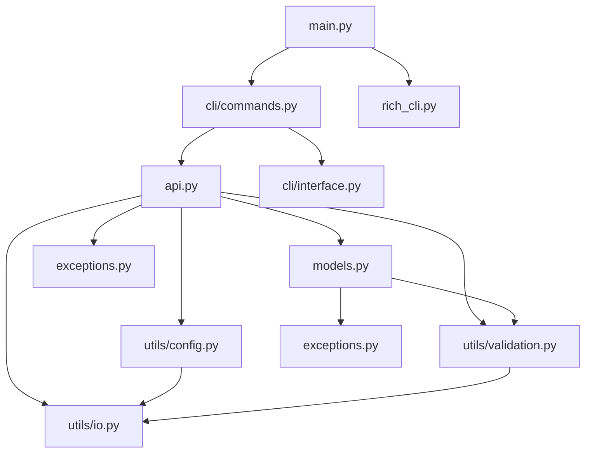
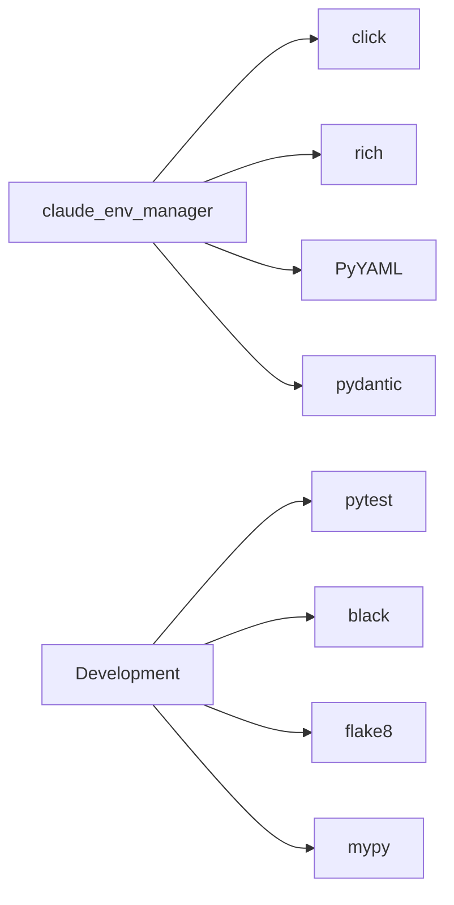
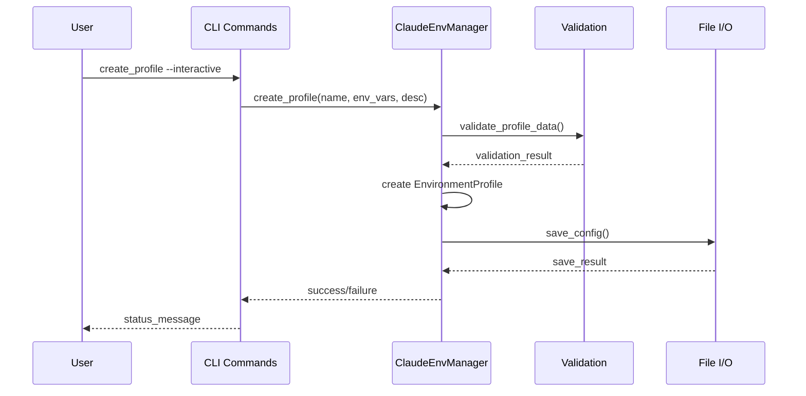
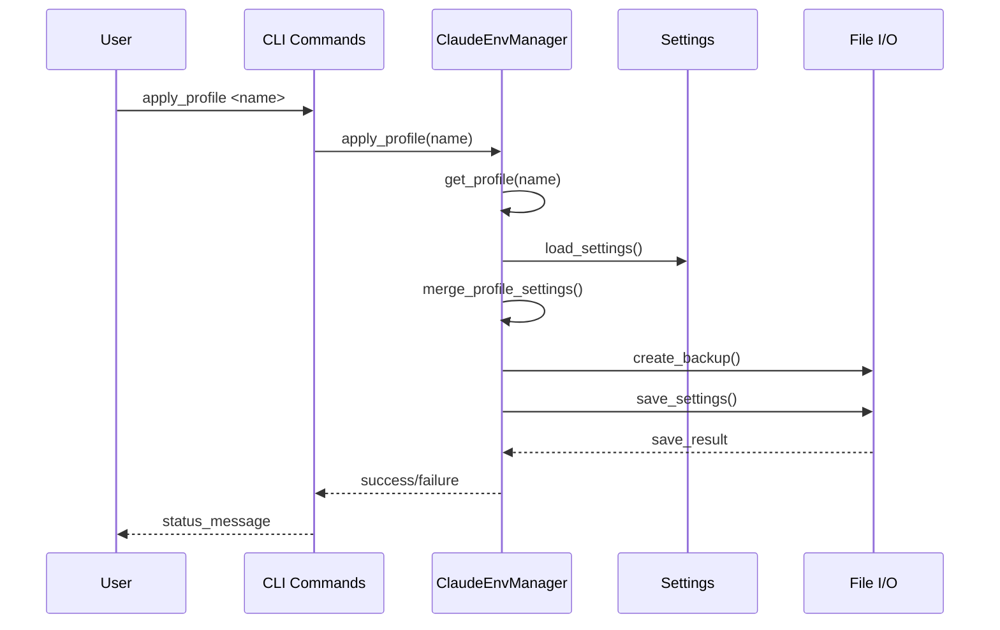

# Claude Code Environment Manager - Project Structure

## 🏗️ Architecture Overview

The Claude Code Environment Manager follows a clean, modular architecture with clear separation of concerns across multiple layers. This document provides a comprehensive overview of the project structure, module relationships, and architectural patterns.

### 📊 Architecture Diagram

```
┌─────────────────────────────────────────────────────────────┐
│                    CLI Layer                                  │
├─────────────────────────────────────────────────────────────┤
│  main.py              rich_cli.py                            │
│  (Entry Point)        (Rich Utilities)                       │
│                                                               │
│  cli/                                                          │
│  ├── commands.py       (CLI Command Implementations)          │
│  └── interface.py      (TUI Interface Components)             │
└─────────────────────────────────────────────────────────────┘
                               │
                               ▼
┌─────────────────────────────────────────────────────────────┐
│                 Business Logic Layer                         │
├─────────────────────────────────────────────────────────────┤
│  api.py               (Core API - ClaudeEnvManager)          │
│  models.py            (Data Models & Validation)             │
│  exceptions.py        (Custom Exceptions)                    │
└─────────────────────────────────────────────────────────────┘
                               │
                               ▼
┌─────────────────────────────────────────────────────────────┐
│                 Data Access Layer                            │
├─────────────────────────────────────────────────────────────┤
│  utils/                                                        │
│  ├── config.py        (Configuration Management)             │
│  ├── validation.py    (Input Validation)                   │
│  └── io.py            (File I/O Operations)                 │
└─────────────────────────────────────────────────────────────┘
                               │
                               ▼
┌─────────────────────────────────────────────────────────────┐
│                 External Systems                             │
├─────────────────────────────────────────────────────────────┤
│  ~/.claude/claude-profiles.yml   (Profile Configuration)    │
│  ~/.claude/settings.json          (Claude Code Settings)     │
└─────────────────────────────────────────────────────────────┘
```

## 📁 Directory Structure

```
claude-code-env-manager/
├── 📄 README.md                          # Project overview and quick start
├── 📄 LICENSE                            # MIT license
├── 📄 pyproject.toml                     # Project configuration
├── 📄 requirements.txt                   # Runtime dependencies
├── 📄 requirements-dev.txt               # Development dependencies
│
├── 📁 src/                              # Source code
│   └── 📁 claude_env_manager/           # Main package
│       ├── 📄 __init__.py               # Package initialization
│       ├── 📄 main.py                   # CLI entry point
│       ├── 📄 api.py                    # Core API class
│       ├── 📄 models.py                 # Data models
│       ├── 📄 exceptions.py             # Custom exceptions
│       ├── 📄 rich_cli.py               # Rich CLI utilities
│       │
│       ├── 📁 cli/                      # CLI components
│       │   ├── 📄 __init__.py           # CLI module initialization
│       │   ├── 📄 commands.py           # Command implementations
│       │   └── 📄 interface.py          # TUI interface components
│       │
│       └── 📁 utils/                    # Utility modules
│           ├── 📄 __init__.py           # Utils module initialization
│           ├── 📄 config.py             # Configuration management
│           ├── 📄 validation.py         # Input validation
│           └── 📄 io.py                 # File I/O operations
│
├── 📁 tests/                            # Test suite
│   ├── 📄 __init__.py                   # Test package initialization
│   ├── 📄 test_api.py                  # API tests
│   ├── 📄 test_models.py               # Model tests
│   ├── 📄 test_profile_config.py       # Profile config tests
│   └── 📄 test_settings.py             # Settings tests
│
├── 📁 config/                           # Default configurations
│   └── 📄 claude-profiles.yml          # Example profile configuration
│
├── 📁 docs/                             # Documentation
│   ├── 📄 DOCUMENTATION_INDEX.md        # Documentation overview
│   ├── 📄 API_REFERENCE.md             # API documentation
│   ├── 📄 ARCHITECTURE.md              # Architecture guide
│   └── 📄 [other documentation files]   # Additional documentation
│
├── 📁 scripts/                          # Utility scripts
│   ├── 📄 install.sh                   # Installation script
│   └── 📄 setup-dev.sh                 # Development setup script
│
├── 📁 htmlcov/                          # Coverage reports
│   ├── 📄 index.html                   # Coverage report index
│   └── 📄 [coverage files]             # Detailed coverage reports
│
└── 📄 [various report files]           # Quality and test reports
```

## 🔧 Module Dependencies

### Core Dependencies



### External Dependencies



## 📋 Module Details

### Core Modules

#### `main.py` - Entry Point
- **Purpose**: CLI application entry point and command routing
- **Key Features**: Click CLI setup, command registration, main function
- **Dependencies**: Click framework, CLI commands module
- **Testing Status**: ❌ 0% coverage

#### `api.py` - Core API
- **Purpose**: Main ClaudeEnvManager class and business logic
- **Key Features**: Profile management, settings integration, validation
- **Dependencies**: Models, exceptions, utilities
- **Testing Status**: ✅ 91% coverage
- **Critical Functions**: 
  - `ClaudeEnvManager.__init__()`
  - `load_config()`, `save_config()`
  - `create_profile()`, `update_profile()`, `delete_profile()`
  - `apply_profile()`, `get_current_profile()`

#### `models.py` - Data Models
- **Purpose**: Data structures and validation rules
- **Key Features**: EnvironmentProfile, ProfileConfig, ClaudeSettings classes
- **Dependencies**: Python standard library, validation
- **Testing Status**: ✅ 100% coverage
- **Critical Classes**:
  - `EnvironmentProfile`: Profile data model with validation
  - `ProfileConfig`: Configuration container
  - `ClaudeSettings`: Claude Code settings model

#### `exceptions.py` - Exception Handling
- **Purpose**: Custom exception classes for error handling
- **Key Features**: Hierarchical exception structure
- **Dependencies**: None (base exceptions)
- **Testing Status**: ✅ 100% coverage
- **Exception Types**:
  - `ClaudeEnvManagerError`: Base exception
  - `ProfileNotFoundError`, `ProfileExistsError`
  - `SettingsFileError`, `ConfigurationError`

### CLI Components

#### `cli/commands.py` - Command Implementations
- **Purpose**: CLI command implementations and handlers
- **Key Features**: Command logic, argument parsing, output formatting
- **Dependencies**: API, models, interface components
- **Testing Status**: ❌ 0% coverage
- **Key Commands**:
  - `list_profiles()`: Display available profiles
  - `create_profile()`: Create new profile
  - `apply_profile()`: Apply profile to settings
  - `update_profile()`: Modify existing profile

#### `cli/interface.py` - TUI Interface
- **Purpose**: Terminal User Interface components
- **Key Features**: Rich-based TUI, interactive elements, visual feedback
- **Dependencies**: Rich library, CLI commands
- **Testing Status**: ❌ 0% coverage
- **Key Components**:
  - Profile selection interface
  - Interactive form components
  - Status and progress displays

#### `rich_cli.py` - Rich CLI Utilities
- **Purpose**: Rich library utilities and helpers
- **Key Features**: Console styling, table formatting, progress bars
- **Dependencies**: Rich library
- **Testing Status**: ❌ 0% coverage

### Utility Modules

#### `utils/config.py` - Configuration Management
- **Purpose**: Configuration file handling and management
- **Key Features**: YAML parsing, configuration validation, path resolution
- **Dependencies**: PyYAML, pathlib
- **Testing Status**: 🟡 29% coverage
- **Key Functions**:
  - `load_yaml_config()`: Load YAML configuration
  - `save_yaml_config()`: Save YAML configuration
  - `validate_config()`: Configuration validation

#### `utils/validation.py` - Input Validation
- **Purpose**: Input validation and sanitization
- **Key Features**: Profile name validation, environment variable validation
- **Dependencies**: Regular expressions, typing
- **Testing Status**: 🟡 36% coverage
- **Key Functions**:
  - `validate_profile_name()`: Profile name validation
  - `validate_environment_vars()`: Environment variable validation
  - `validate_api_key_format()`: API key format validation

#### `utils/io.py` - File I/O Operations
- **Purpose**: File input/output operations and utilities
- **Key Features**: Safe file operations, backup creation, error handling
- **Dependencies**: Pathlib, JSON, YAML
- **Testing Status**: 🟡 29% coverage
- **Key Functions**:
  - `safe_read_file()`: Safe file reading
  - `safe_write_file()`: Safe file writing
  - `create_backup()`: Backup file creation

## 🔄 Data Flow

### Profile Creation Flow



### Profile Application Flow



## 🛡️ Security Considerations

### Data Security
- **API Keys**: Validated for format, never logged or displayed in full
- **Configuration Files**: Created with appropriate file permissions
- **Backup Strategy**: Automatic backup creation before modifications
- **Input Sanitization**: All user inputs validated and sanitized

### File Security
- **Safe File Operations**: All file operations use safe I/O utilities
- **Path Validation**: File paths validated to prevent directory traversal
- **Permission Handling**: Proper error handling for permission issues
- **Atomic Operations**: Configuration changes use atomic write operations

## 🚀 Performance Considerations

### Caching Strategy
- **Configuration Cache**: In-memory caching of loaded configurations
- **Settings Cache**: Caching of Claude Code settings
- **Cache Invalidation**: Manual cache clearing available
- **Memory Usage**: Minimal memory footprint for cached data

### I/O Optimization
- **Lazy Loading**: Configuration loaded only when needed
- **Batch Operations**: Multiple changes grouped into single save operations
- **File Monitoring**: Configuration files monitored for external changes
- **Error Recovery**: Graceful handling of I/O errors

## 🔧 Configuration Management

### Configuration Files
- **Primary Config**: `~/.claude/claude-profiles.yml` (YAML format)
- **Settings File**: `~/.claude/settings.json` (JSON format)
- **Backup Files**: Automatic timestamped backups
- **Custom Paths**: Support for custom configuration paths

### Environment Variables
- **CLAUDE_ENV_MANAGER_CONFIG**: Override default config path
- **CLAUDE_ENV_MANAGER_SETTINGS**: Override default settings path
- **CLAUDE_ENV_MANAGER_DEBUG**: Enable debug logging
- **CLAUDE_ENV_MANAGER_VERBOSE**: Enable verbose output

## 📊 Testing Strategy

### Test Coverage by Module
- **Models**: ✅ 100% - Complete coverage of data models
- **API**: ✅ 91% - Comprehensive API testing
- **Exceptions**: ✅ 100% - All exception cases covered
- **CLI Commands**: ❌ 0% - No CLI testing currently
- **TUI Interface**: ❌ 0% - No interface testing currently
- **Utilities**: 🟡 29-36% - Partial utility coverage

### Test Types
- **Unit Tests**: Individual function and method testing
- **Integration Tests**: Cross-module interaction testing
- **Validation Tests**: Input validation and error handling
- **Mock Testing**: External dependencies mocked

## 🎯 Future Enhancements

### Planned Improvements
- **CLI Testing**: Add comprehensive CLI command testing
- **TUI Testing**: Implement terminal interface testing
- **Performance Testing**: Add benchmark and load testing
- **Security Testing**: Implement security vulnerability testing
- **Integration Testing**: End-to-end workflow testing

### Architecture Improvements
- **Plugin System**: Support for external plugins and extensions
- **Configuration Templates**: Template-based profile creation
- **Multi-user Support**: Support for multiple user configurations
- **Cloud Storage**: Integration with cloud configuration storage
- **API Server**: Optional REST API for remote management

---

*Project Structure Documentation generated: 2025-08-30*